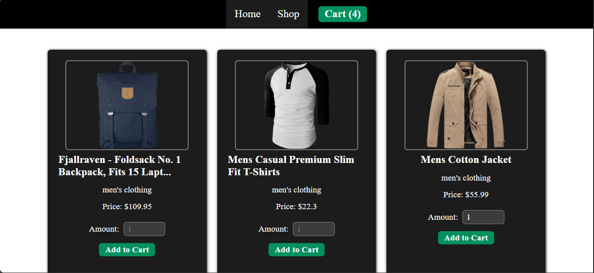

# Shopping Cart
## Description
In this project, i have created a a mock shopping cart.

**[Check it here](https://cesar-a-delacruz-shopping-cart.netlify.app/)**

### Screenshot

## Steps
1. Created a new React project.

2. Think about how to structure the application. 

3. Include at least two pages (a home page and a shop page with a shopping cart). Both apges displaying a navigation bar and a footer which credits the owners of the resources used.

4. Add content to the pages. An image and a sentence for the home page, individual card elements with details of each product for the shop page.     

5. Fetch the products from [FakeStore API](https://fakestoreapi.com/).

6. Allow users to submit their order, and see the amount on a cart.

7. Test the app.